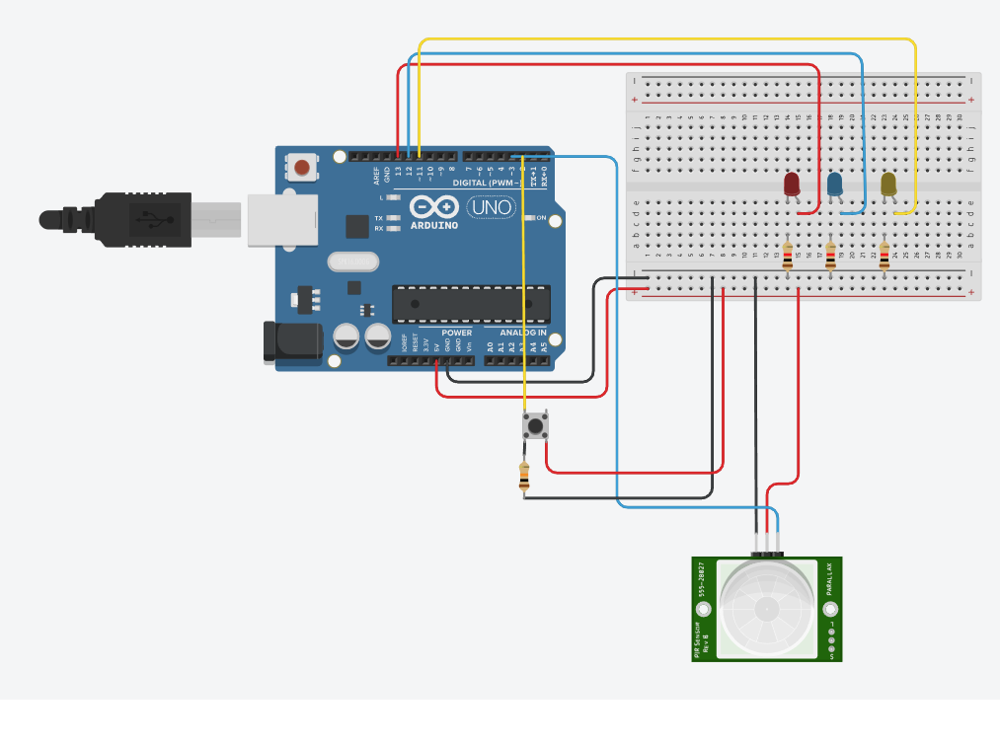
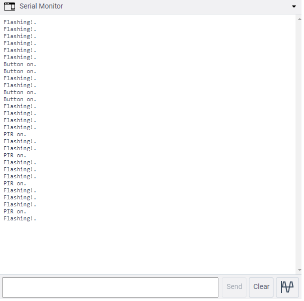

### Task 1.4D

Below are some images of my system. There are two interrupts, one for each LED. There is also a timed interrupt for the yellow LED.

Please see [here](https://youtu.be/3M0Rwom6SYI) for a video demonstration.

