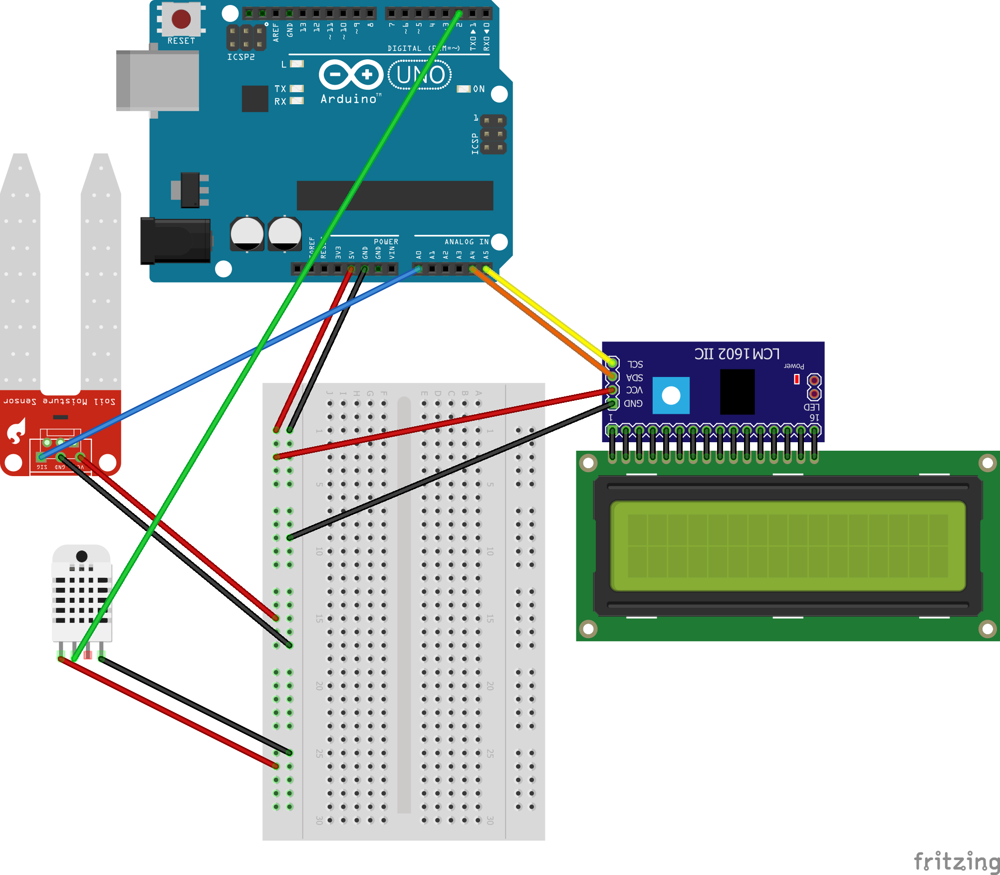

## SIT315
# Task 1.1P Build a simple Sense-Think-Act Board

This project is designed for monitoring the conditions necessary for maintaining healthy plants. It uses sensors to measure the soil humidity, temperature, and humidity, and then writes those variables to a LCD screen for the user to see.

## Project components
### Sense hardware
* A DHT22 humidity and temperature sensor
* a soil moisture sensor
### Think hardware
* Arduino Uno R3
### Act hardware
* a 16 x 2 LCD screen
* an I2C port expander for the LCD screen (not necessary but simplifies the wiring)

## Project construction
Using the Arduino IDE, install and import the following dependencies:
* Marco Schwartz's LiquidCrystalI2C
* Adafruit's DHT sensor library

You may need to find the address of the LCD screen - my code uses the default 0x27 but you can find address scanners in the Arduino library.

If necessary, solder your I2C expander onto your LCD screen.

Connect the wires according to the diagram below.

[Schematic Diagram]

## Example of system in use

